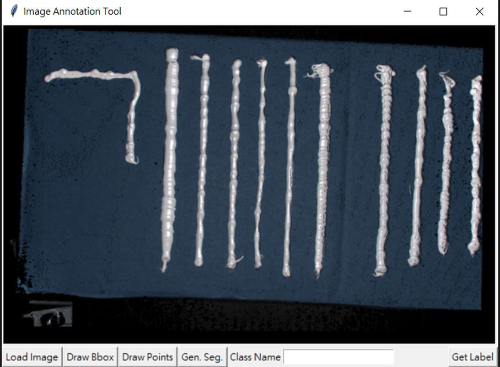
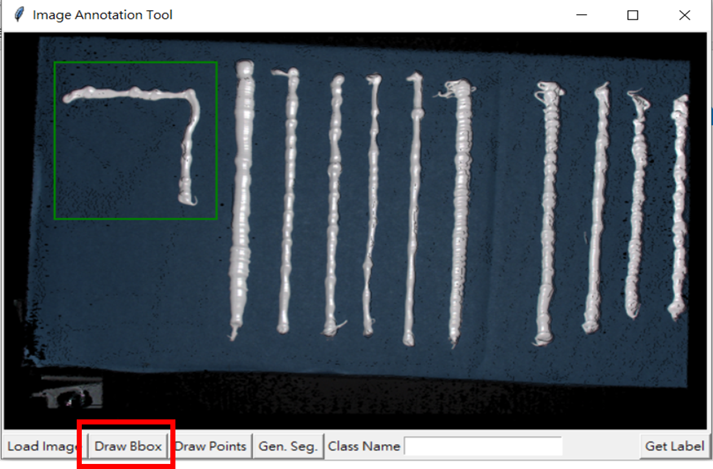
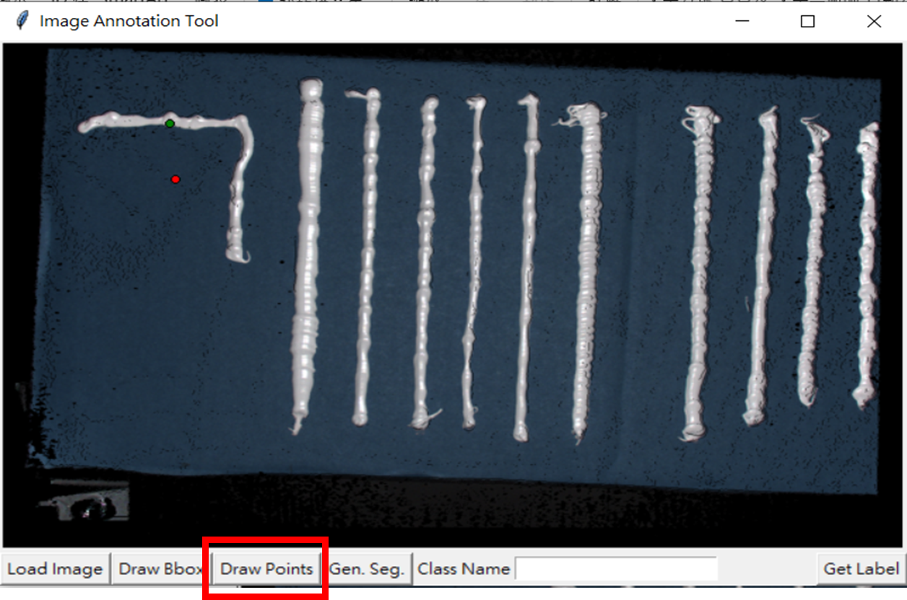
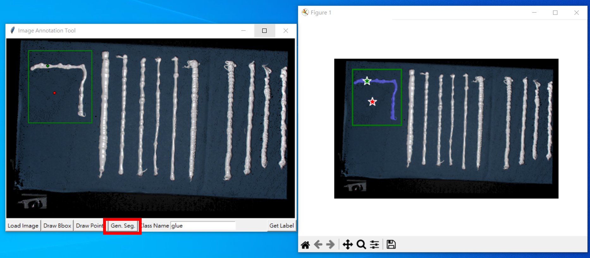
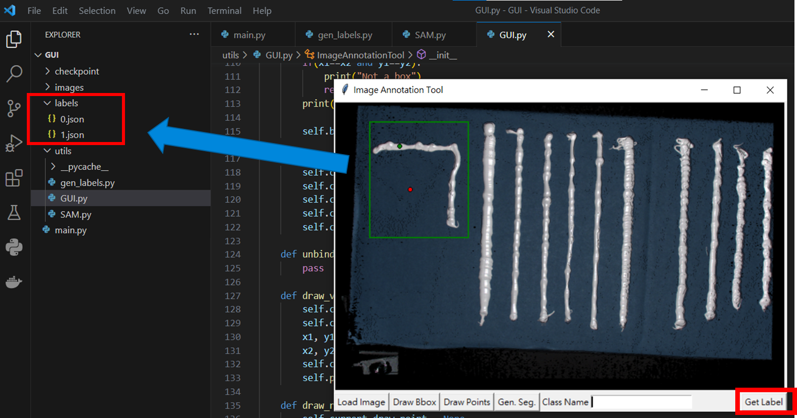

# SAM-Tool
Graphical User Interface (GUI) utilities for image segmentation employing "SAM," "MobileSAM," and "FastSAM."

## Installation
### Build SAM and MobileSAM env.
    pip install requirements.txt

### Build FastSAM env.
    git clone https://github.com/CASIA-IVA-Lab/FastSAM.git
    cd FastSAM
    pip install -r requirements.txt

## Run
### SAM
    python main.py --config configs/SAM.yml

### MobileSAM
    python main.py --config configs/mobileSAM.yml

### FastSAM
    python main.py --config configs/fastSAM.yml

## Demonstration
### Load image

### Add prompts
#### BBox

#### point
Left click for valid points  
Right click for invalid points  
Middle click for add points as prompts  

#### Generate segmentation

#### Generate mask labels

## Reference
SAM: https://github.com/facebookresearch/segment-anything  
MobileSAM: https://github.com/ChaoningZhang/MobileSAM  
FastSAM: https://github.com/CASIA-IVA-Lab/FastSAM 